# Traffic Sign Recognition

### Build a Traffic Sign Recognition Project

The goals / steps of this project are the following:
* Load the data set (see below for links to the project data set)
* Explore, summarize and visualize the data set
* Design, train and test a model architecture
* Use the model to make predictions on new images
* Analyze the softmax probabilities of the new images
* Summarize the results with a written report

## Rubric Points

### Data Set Summary & Exploration

I used the pandas library to calculate summary statistics of the traffic
signs data set:

- `34799` training samples in total.
- `12630` testing samples in total.
- `4410` validation samples in total.
- Every sample is an image of 32 by 32 pixels and a depth of 3, which represents the three color channels: Red, green, and blue. This sums up to `3072` dimensions.
- `43` different classes. Each class is a specific traffic sign.

The classes are distributed **imbalanced** as the following plot shows:

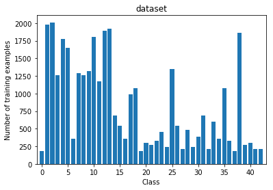

Examples from the dataset include

- Class 0 ("Speed limit (20km/h)") 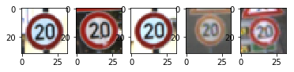
- Class 10 ("No passing for vehicles over 3.5 metric tons") 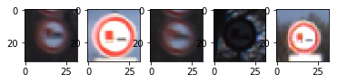
- Class 32 ("End of all speed and passing limits") 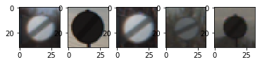

  ... which is my favorite.

By evaluating several images, the following thins can be noted:

- Images are captured front facing in most cases. The sign always
  faces the camera in an 90° angle.
- In some cases, the picture is not sharp, e.g. sign 1 & 3 of class 10. Even a
  human would have a hard time to tell the signtype in this case.
- Exposure and lightning varies - some signs are overexposed, some signs are
  very dark.
- Sign size on the image varies: The diameter of the sign takes roughly between
  60%-80% of the complete image width/ height.

### Preprocessing

Preprocessing steps included

- Converting to grayscale
- Using `exposure.equalize_adapthist()` from `skimage`
- Augmenting the dataset by flipping
- Augmenting the dataset by transforming

#### Converting to grayscale

Conversion to grayscale is done in order to reduce the dimensionality of the
image from 3 depth channels (red, green, blue, or RGB) to 1 depth channel (black
  to white). This means a data reduction by `(1*32*32) / (3*32*32) = 33%`.

#### Equalizing histograms

To tackle the different exposure / brightness of the traffic sign images,
`exposure.equalize_adapthist()` from `skimage` is used.

#### Augmenting by flipping

To generate more training data - especially with deep learning it's always better
to have more training data - some images can be flipped to generate a new sample
for the same or a different class.

Take for example class 36 ("go straight or right"). This image can be flipped horizontally to create a new sample, in this case from
class 37 ("go straight or left").

Also, there are cases where the image label remains the same after being flipped
horizontally, e.g. class 35 ("ahead only").

Some classes can only be flipped vertically and horizontally, like class 32
("End of all speed and passing limits").

To do this flipping programmatically, an array was created to indicate the legal
flipping possibilities

    augmentables = [
        # image_num, flip_x, flip_y, flip_xy, new class after transformation
        # -1 means that image has not to be relabed after flipping
        [0, 0, 0, 0, -1],   # class Speed limit (20km/h)
        # ...
        [11, 1, 0, 0, -1],  # class Right-of-way at the next intersection
        [17, 1, 1, 1, -1],  # class No entry
        # ...
    ]
After enhancing, class distribution changed. Especially for class 12 ("Priority
road") many samples were generated, since flipping is possible vertically,
horizontally and the combination:

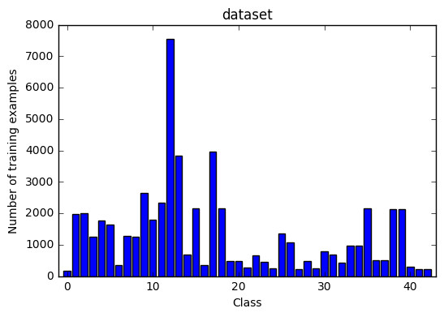

#### Augmenting by transforming

To generate even more data, and to balance the dataset, images were transformed
and added without relabeling to the dataset. Balancing a dataset has several
benefits like more meaningfull classificatoin metrics (e.g. accuracy) and a
classifier that is not biased towards an over-represented class. Another
advantage of using transformed images for training is to prevent overfitting.

The transformation was performed using primarily `ProjectiveTransform()` from
`skimage.transform`.

The basic idea is shown in the following image:

1. Get 4 points in the image. Each of the points has the same distance to the
  closest right/left and upper/lower border. The distance is set by
  `distance = intensity * image_width`. The higher the intensity, the closer the
  corners will be to the center of the image.
- In a second step, all corners are moved by a random amount to the outside of  
  the image. This is bounded by the original image dimensions.
- In a third step, the subimage defined by the corners from step 1 is stretched
  using `skimage.transform()` that the corners align with the corners from
  step 2.

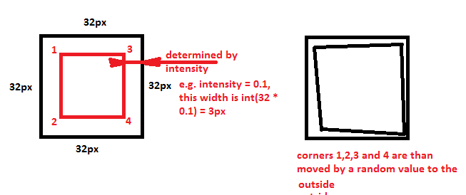

This resulted into the following images:

- Class 0 ("Speed limit (20km/h)") 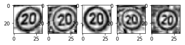
- Class 10 ("No passing for vehicles over 3.5 metric tons") 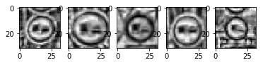
- Class 32 ("End of all speed and passing limits") 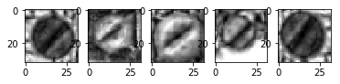

Design and Test a Model Architecture

### Modeling

#### Model Architecture

My final model consisted of the following layers:

| Layer         		| Params | Input | Output |
|:------:|:-----:|:-----:|:-----:|
| Input         		| grayscale image   							| | 32x32x1 |
| Convolution 			| 5x5, 1x1 stride, same padding| 32x32x1 | 28x28x6 |
| RELU					|	- | 28x28x6| 28x28x6 |
| Max pooling	      	| 2x2 stride |  28x28x6 | 14x14x6 |
| Convolution 			| 5x5, 1x1 stride, same padding| 14x14x6 | 10x10x16 |
| RELU					|	- | 10x10x16| 10x10x16 |
| Dropout 				| 50% | 10x10x16 | 10x10x16 |
| Max pooling	  		| 2x2 stride |  10x10x16 | 5x5x16 |
| Fully Connected 		| - | 400 | 120 |
| RELU					|	- | 120 | 120 |
| Dropout 				| 50% | 120 | 120 |
| Fully Connected 		| - | 120 | 84 |
| RELU					|	- | 120 | 120 |
| Fully Connected 		| - | 84 | 43 |

I didn't experiment much with the model architecture but focussed on other things
like regularization (see next section) and data preprocessing, since their effect
on the model performance seemed more deterministic to me. I therefore went with
a slight modification of the standard LeNet architecture, since this net was
developed for a similar application and performs very well.

#### Model training

After a lot of trial and error, I trained my model using the following
hyperparameters.

- `LEARNING_RATE = 0.00005`
- `EPOCHS = 500`
- `BATCH_SIZE = 256`
- `BETA = 0.001`

`BETA` determines the regularization constant, which defines the tradeoff
between training error and model weights. Since the model weights are part of
the error term (the larger the weights, the larger the error term) this prevents overfitting.

Optimazation was done using the [AdamOptimizer](https://www.tensorflow.org/api_docs/python/tf/train/AdamOptimizer).

My final model results were:
* training set accuracy of `0.995`
* validation set accuracy of `0.965`
* test set accuracy of `0.947` (this data was never seen before by the Net)

If an iterative approach was chosen:
* I started with LeNet, but this achieved low accuracy.
* I added regularization.
* I added dropout layers to improve generalization.
* I added additional convulational and pooling layers to increase depth.
* I reduced the `LEARNING_RATE`. This lead to a smaller accuracy after each
  epoch but gave a larger, final training accuracy.
* I adjusted the batch size to fit my system. Larger batch sizes ran painfully
  slow.
* I increased the number of EPOCH to a (presumalby to high number) to achieve
  highest accuracy. Basically to many EPOCH do not harm your accuracy, just
  the training time.

### Test a Model on New Images

Here are five German traffic signs that I found on the web:

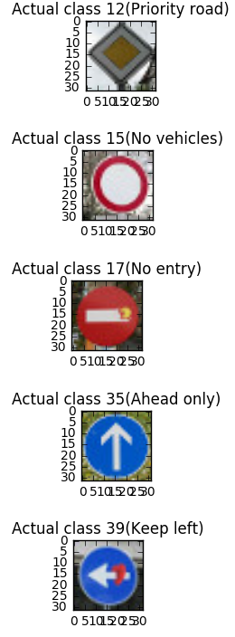

The first two images are easy to classify, since lighting is just fine and the
overall image is good. The third image has a small Pacman sticker on it, that
is eating the white bar. This may make the classification a little bit harder.
The fourth sign should be easy to classify. The last sign might be hard since
a sticker is on this sign as well (a heart) and the sign is pointing to left
(instead to the bottom left).

Here are the results of the prediction:

| Image			        |     Prediction	        					|
|:---------------------:|:---------------------------------------------:|
| Priority road     		| Priority road   									|
| No vehicles | No vehicles |
| No entry | No entry |
| Ahead only | Ahead only |
| Keep left | Roundabout mandatory |

The model was able to correctly guess 4 of the 5 traffic signs, which gives an accuracy of 80%. This compares favorably to the accuracy on the test set of `0.947`.

Looking at the softmax probabilities given in the following image, the model is
specifically good at predicting the first (class 12), second (class 15) and fourth
(clas 35) image with probabilities above `99%`. Class 17 was "only" predicted
with a probability of `78.8%` and the correct prediction for the fivth image (class 39)
was ranked as fourth guess (probability of `5,6%`).

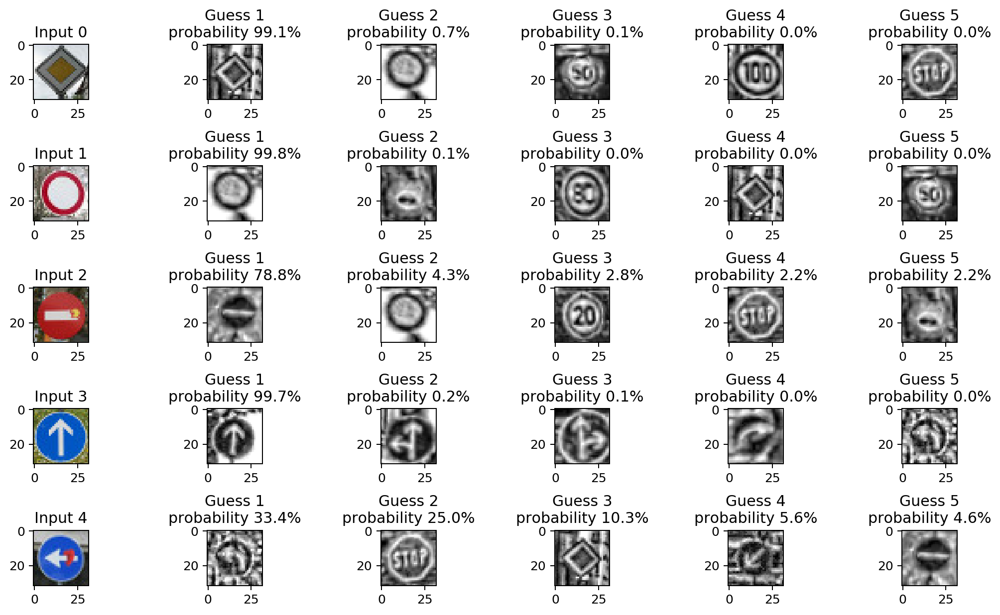
